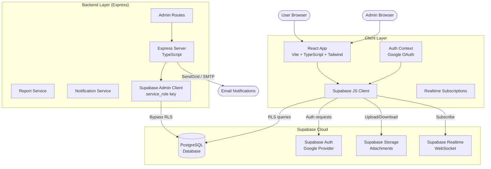
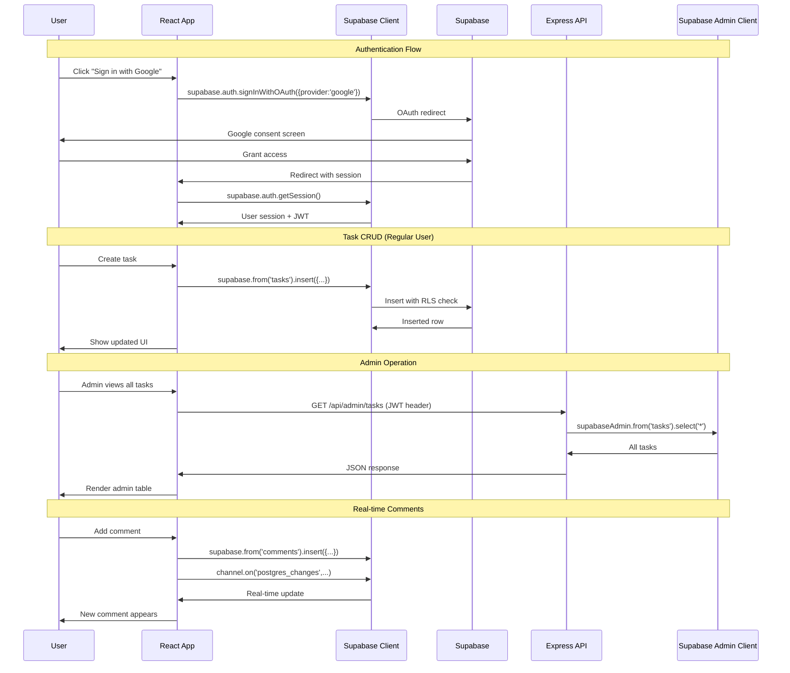

# UCS Task Manager — System Architecture

## Overview

UCS Task Manager is a full-stack web application for managing tasks within the company. It uses **Supabase** as the BaaS (Backend-as-a-Service) for database, authentication, storage, and real-time features, with a **Node.js/Express** backend for admin-specific operations and a **React** frontend.

---

## Tech Stack

| Layer | Technology | Purpose |
|---|---|---|
| **Frontend** | React 18 + TypeScript + Vite | UI rendering |
| **Styling** | Tailwind CSS 3 | Utility-first styling |
| **Drag & Drop** | @dnd-kit | Kanban board |
| **Charts** | Recharts | Analytics |
| **Print/Export** | jsPDF | PDF reports |
| **Backend** | Node.js + Express + TypeScript | Admin APIs, reports, notifications |
| **Database** | Supabase PostgreSQL | All persistent data |
| **Auth** | Supabase Auth (Google OAuth) | User authentication |
| **Storage** | Supabase Storage | File attachments |
| **Realtime** | Supabase Realtime | Live comments & activity |
| **Hosting** | Vercel (client) / Render (backend) | Deployment |

---

## System Architecture Diagram



---

## Data Flow



---

## Folder Structure

```
ucs-task-manager/
├── client/                     # React frontend
│   ├── public/
│   ├── src/
│   │   ├── components/
│   │   │   ├── ui/             # Reusable UI primitives
│   │   │   ├── layout/         # Sidebar, Header, Layout
│   │   │   ├── tasks/          # Task-specific components
│   │   │   ├── comments/       # Comment components
│   │   │   ├── team/           # Team components
│   │   │   └── admin/          # Admin components
│   │   ├── pages/              # Route pages
│   │   ├── hooks/              # Custom React hooks
│   │   ├── lib/                # Utilities + Supabase client
│   │   ├── contexts/           # React contexts
│   │   └── types/             # TypeScript types
│   ├── index.html
│   ├── package.json
│   ├── tsconfig.json
│   ├── vite.config.ts
│   └── tailwind.config.ts
├── backend/
│   ├── supabase/
│   │   ├── migrations/         # SQL migration files
│   │   └── seed.sql            # Seed data
│   ├── src/
│   │   ├── routes/             # Express route handlers
│   │   ├── middleware/         # Auth & error middleware
│   │   ├── services/           # Business logic
│   │   ├── config/            # Supabase client, env
│   │   └── index.ts           # Entry point
│   ├── functions/              # Supabase Edge Functions
│   ├── package.json
│   └── tsconfig.json
└── docs/
    ├── architecture.md
    ├── requirements.md
    ├── database-schema.md
    ├── api-design.md
    ├── ui-ux.md
    ├── security.md
    └── deployment.md
```

---

## Key Design Decisions

1. **Supabase-first approach** — Most client operations talk directly to Supabase with RLS for security. Express backend is only used for admin endpoints that need to bypass RLS.

2. **Row Level Security (RLS)** — All tables have strict RLS policies. Regular users can only see tasks they created or are assigned to. Admins can see everything.

3. **Real-time by default** — Comments and activity logs use Supabase Realtime subscriptions for live updates.

4. **JWT-based auth** — The Express backend verifies Supabase JWTs to authorize requests. Admins are identified by their `role` field in the `users` table.

5. **Service role key** — The Express backend uses Supabase's `service_role` key (never exposed to the client) to bypass RLS for admin operations.
