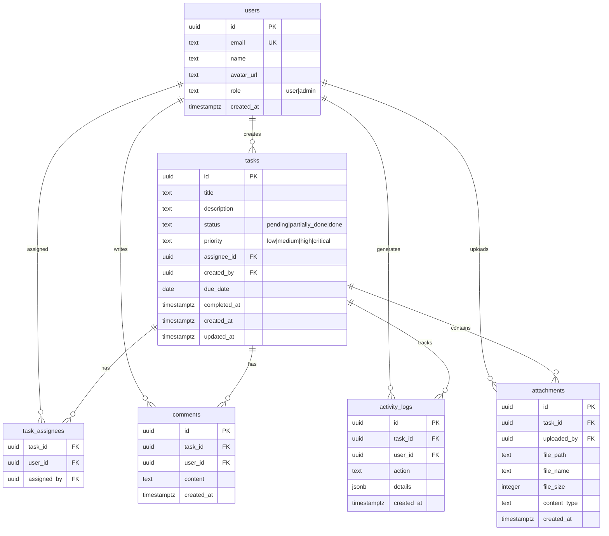

# UCS Task Manager — Database Schema

## Overview

Database hosted on **Supabase PostgreSQL**. All tables use UUID primary keys and track creation/update timestamps. Row-Level Security (RLS) is enforced on all tables.

---

## Entity Relationship Diagram



---

## Full SQL Schema

```sql
-- 001_schema.sql

-- ============================================
-- EXTENSIONS
-- ============================================
CREATE EXTENSION IF NOT EXISTS "pgcrypto";
CREATE EXTENSION IF NOT EXISTS "uuid-ossp";

-- ============================================
-- USERS TABLE
-- ============================================
CREATE TABLE users (
  id UUID PRIMARY KEY REFERENCES auth.users ON DELETE CASCADE,
  email TEXT UNIQUE NOT NULL,
  name TEXT,
  avatar_url TEXT,
  role TEXT NOT NULL DEFAULT 'user' CHECK (role IN ('user', 'admin')),
  created_at TIMESTAMPTZ NOT NULL DEFAULT NOW()
);

-- Trigger to auto-create user row on signup
CREATE OR REPLACE FUNCTION public.handle_new_user()
RETURNS TRIGGER AS $$
BEGIN
  INSERT INTO public.users (id, email, name, avatar_url)
  VALUES (new.id, new.email, new.raw_user_meta_data->>'full_name', new.raw_user_meta_data->>'avatar_url');
  RETURN NEW;
END;
$$ LANGUAGE plpgsql SECURITY DEFINER;

CREATE OR REPLACE TRIGGER on_auth_user_created
  AFTER INSERT ON auth.users
  FOR EACH ROW
  EXECUTE FUNCTION public.handle_new_user();

CREATE INDEX idx_users_email ON users(email);
CREATE INDEX idx_users_role ON users(role);

-- ============================================
-- TASKS TABLE
-- ============================================
CREATE TABLE tasks (
  id UUID PRIMARY KEY DEFAULT gen_random_uuid(),
  title TEXT NOT NULL,
  description TEXT DEFAULT '',
  status TEXT NOT NULL DEFAULT 'pending'
    CHECK (status IN ('pending', 'partially_done', 'done')),
  priority TEXT NOT NULL DEFAULT 'medium'
    CHECK (priority IN ('low', 'medium', 'high', 'critical')),
  created_by UUID NOT NULL REFERENCES users(id) ON DELETE CASCADE,
  due_date DATE,
  completed_at TIMESTAMPTZ,
  created_at TIMESTAMPTZ NOT NULL DEFAULT NOW(),
  updated_at TIMESTAMPTZ NOT NULL DEFAULT NOW()
);

CREATE INDEX idx_tasks_status ON tasks(status);
CREATE INDEX idx_tasks_priority ON tasks(priority);
CREATE INDEX idx_tasks_created_by ON tasks(created_by);
CREATE INDEX idx_tasks_due_date ON tasks(due_date);
CREATE INDEX idx_tasks_created_at ON tasks(created_at);

-- ============================================
-- TASK ASSIGNESS (many-to-many)
-- ============================================
CREATE TABLE task_assignees (
  task_id UUID NOT NULL REFERENCES tasks(id) ON DELETE CASCADE,
  user_id UUID NOT NULL REFERENCES users(id) ON DELETE CASCADE,
  assigned_by UUID NOT NULL REFERENCES users(id),
  PRIMARY KEY (task_id, user_id)
);

CREATE INDEX idx_task_assignees_user ON task_assignees(user_id);

-- ============================================
-- COMMENTS TABLE
-- ============================================
CREATE TABLE comments (
  id UUID PRIMARY KEY DEFAULT gen_random_uuid(),
  task_id UUID NOT NULL REFERENCES tasks(id) ON DELETE CASCADE,
  user_id UUID NOT NULL REFERENCES users(id) ON DELETE CASCADE,
  content TEXT NOT NULL,
  created_at TIMESTAMPTZ NOT NULL DEFAULT NOW()
);

CREATE INDEX idx_comments_task ON comments(task_id);
CREATE INDEX idx_comments_created ON comments(created_at DESC);

-- ============================================
-- ACTIVITY LOGS TABLE
-- ============================================
CREATE TABLE activity_logs (
  id UUID PRIMARY KEY DEFAULT gen_random_uuid(),
  task_id UUID NOT NULL REFERENCES tasks(id) ON DELETE CASCADE,
  user_id UUID NOT NULL REFERENCES users(id),
  action TEXT NOT NULL,
  details JSONB DEFAULT '{}',
  created_at TIMESTAMPTZ NOT NULL DEFAULT NOW()
);

CREATE INDEX idx_activity_task ON activity_logs(task_id);
CREATE INDEX idx_activity_created ON activity_logs(created_at DESC);

-- ============================================
-- ATTACHMENTS TABLE
-- ============================================
CREATE TABLE attachments (
  id UUID PRIMARY KEY DEFAULT gen_random_uuid(),
  task_id UUID NOT NULL REFERENCES tasks(id) ON DELETE CASCADE,
  uploaded_by UUID NOT NULL REFERENCES users(id),
  file_path TEXT NOT NULL,
  file_name TEXT NOT NULL,
  file_size INTEGER NOT NULL,
  content_type TEXT NOT NULL DEFAULT 'application/octet-stream',
  created_at TIMESTAMPTZ NOT NULL DEFAULT NOW()
);

CREATE INDEX idx_attachments_task ON attachments(task_id);

-- ============================================
-- AUTO-UPDATE updated_at TRIGGER
-- ============================================
CREATE OR REPLACE FUNCTION update_updated_at_column()
RETURNS TRIGGER AS $$
BEGIN
  NEW.updated_at = NOW();
  RETURN NEW;
END;
$$ LANGUAGE plpgsql;

CREATE TRIGGER set_tasks_updated_at
  BEFORE UPDATE ON tasks
  FOR EACH ROW
  EXECUTE FUNCTION update_updated_at_column();

-- ============================================
-- ACTIVITY LOG TRIGGERS
-- ============================================
CREATE OR REPLACE FUNCTION log_task_activity()
RETURNS TRIGGER AS $$
BEGIN
  IF TG_OP = 'INSERT' THEN
    INSERT INTO activity_logs (task_id, user_id, action, details)
    VALUES (NEW.id, NEW.created_by, 'task_created',
      jsonb_build_object('title', NEW.title));
  ELSIF TG_OP = 'UPDATE' THEN
    IF OLD.status <> NEW.status THEN
      INSERT INTO activity_logs (task_id, user_id, action, details)
      VALUES (NEW.id, NEW.created_by, 'status_changed',
        jsonb_build_object('from', OLD.status, 'to', NEW.status));
    END IF;
    IF OLD.priority <> NEW.priority THEN
      INSERT INTO activity_logs (task_id, user_id, action, details)
      VALUES (NEW.id, NEW.created_by, 'priority_changed',
        jsonb_build_object('from', OLD.priority, 'to', NEW.priority));
    END IF;
    IF OLD.title <> NEW.title THEN
      INSERT INTO activity_logs (task_id, user_id, action, details)
      VALUES (NEW.id, NEW.created_by, 'title_changed',
        jsonb_build_object('from', OLD.title, 'to', NEW.title));
    END IF;
    IF NEW.completed_at IS NOT NULL AND OLD.completed_at IS NULL THEN
      INSERT INTO activity_logs (task_id, user_id, action, details)
      VALUES (NEW.id, NEW.created_by, 'task_completed', '{}');
    END IF;
  END IF;
  RETURN COALESCE(NEW, OLD);
END;
$$ LANGUAGE plpgsql SECURITY DEFINER;

CREATE TRIGGER log_task_changes
  AFTER INSERT OR UPDATE ON tasks
  FOR EACH ROW
  EXECUTE FUNCTION log_task_activity();

CREATE OR REPLACE FUNCTION log_task_assignment()
RETURNS TRIGGER AS $$
BEGIN
  INSERT INTO activity_logs (task_id, user_id, action, details)
  VALUES (NEW.task_id, NEW.assigned_by, 'user_assigned',
    jsonb_build_object('user_id', NEW.user_id));
  RETURN NEW;
END;
$$ LANGUAGE plpgsql SECURITY DEFINER;

CREATE TRIGGER log_task_assignee
  AFTER INSERT ON task_assignees
  FOR EACH ROW
  EXECUTE FUNCTION log_task_assignment();

-- ============================================
-- ROW LEVEL SECURITY
-- ============================================
ALTER TABLE users ENABLE ROW LEVEL SECURITY;
ALTER TABLE tasks ENABLE ROW LEVEL SECURITY;
ALTER TABLE task_assignees ENABLE ROW LEVEL SECURITY;
ALTER TABLE comments ENABLE ROW LEVEL SECURITY;
ALTER TABLE activity_logs ENABLE ROW LEVEL SECURITY;
ALTER TABLE attachments ENABLE ROW LEVEL SECURITY;

-- Users: everyone can read, only trigger inserts
CREATE POLICY "users_select" ON users FOR SELECT USING (true);
CREATE POLICY "users_update_own" ON users FOR UPDATE
  USING (id = auth.uid());

-- Tasks: users see tasks they created OR are assigned to; admins see all
CREATE POLICY "tasks_select" ON tasks FOR SELECT
  USING (
    created_by = auth.uid()
    OR EXISTS (SELECT 1 FROM task_assignees WHERE task_id = tasks.id AND user_id = auth.uid())
    OR (SELECT role FROM users WHERE id = auth.uid()) = 'admin'
  );

CREATE POLICY "tasks_insert" ON tasks FOR INSERT
  WITH CHECK (created_by = auth.uid());

CREATE POLICY "tasks_update" ON tasks FOR UPDATE
  USING (created_by = auth.uid() OR (SELECT role FROM users WHERE id = auth.uid()) = 'admin');

CREATE POLICY "tasks_delete" ON tasks FOR DELETE
  USING (created_by = auth.uid() OR (SELECT role FROM users WHERE id = auth.uid()) = 'admin');

-- Task assignees: visible to task creator, assignee, and admins
CREATE POLICY "task_assignees_select" ON task_assignees FOR SELECT
  USING (
    EXISTS (SELECT 1 FROM tasks WHERE id = task_assignees.task_id AND created_by = auth.uid())
    OR user_id = auth.uid()
    OR (SELECT role FROM users WHERE id = auth.uid()) = 'admin'
  );

CREATE POLICY "task_assignees_insert" ON task_assignees FOR INSERT
  WITH CHECK (
    EXISTS (SELECT 1 FROM tasks WHERE id = task_assignees.task_id AND created_by = auth.uid())
    OR (SELECT role FROM users WHERE id = auth.uid()) = 'admin'
  );

CREATE POLICY "task_assignees_delete" ON task_assignees FOR DELETE
  USING (
    EXISTS (SELECT 1 FROM tasks WHERE id = task_assignees.task_id AND created_by = auth.uid())
    OR (SELECT role FROM users WHERE id = auth.uid()) = 'admin'
  );

-- Comments: users see comments on tasks they can access
CREATE POLICY "comments_select" ON comments FOR SELECT
  USING (EXISTS (SELECT 1 FROM tasks WHERE id = comments.task_id AND (
    created_by = auth.uid()
    OR EXISTS (SELECT 1 FROM task_assignees WHERE task_id = tasks.id AND user_id = auth.uid())
    OR (SELECT role FROM users WHERE id = auth.uid()) = 'admin'
  )));

CREATE POLICY "comments_insert" ON comments FOR INSERT
  WITH CHECK (user_id = auth.uid());

CREATE POLICY "comments_delete" ON comments FOR DELETE
  USING (user_id = auth.uid() OR (SELECT role FROM users WHERE id = auth.uid()) = 'admin');

-- Activity logs: visible to task participants and admins
CREATE POLICY "activity_logs_select" ON activity_logs FOR SELECT
  USING (EXISTS (SELECT 1 FROM tasks WHERE id = activity_logs.task_id AND (
    created_by = auth.uid()
    OR EXISTS (SELECT 1 FROM task_assignees WHERE task_id = tasks.id AND user_id = auth.uid())
    OR (SELECT role FROM users WHERE id = auth.uid()) = 'admin'
  )));

-- Attachments: same as comments
CREATE POLICY "attachments_select" ON attachments FOR SELECT
  USING (EXISTS (SELECT 1 FROM tasks WHERE id = attachments.task_id AND (
    created_by = auth.uid()
    OR EXISTS (SELECT 1 FROM task_assignees WHERE task_id = tasks.id AND user_id = auth.uid())
    OR (SELECT role FROM users WHERE id = auth.uid()) = 'admin'
  )));

CREATE POLICY "attachments_insert" ON attachments FOR INSERT
  WITH CHECK (uploaded_by = auth.uid());

CREATE POLICY "attachments_delete" ON attachments FOR DELETE
  USING (uploaded_by = auth.uid() OR (SELECT role FROM users WHERE id = auth.uid()) = 'admin');
```

---

## Seed Data

```sql
-- seed.sql
-- Only run after migrations are applied

-- Create admin user (replace with actual admin email)
-- Note: The user must first sign in via Google, then run:
UPDATE users SET role = 'admin' WHERE email = 'admin@ucs.com';

-- Sample users (will be auto-created via auth trigger on real sign-in)
-- Sample tasks for demo
INSERT INTO tasks (title, description, status, priority, created_by, due_date)
VALUES
  ('Design homepage mockup', 'Create wireframes for the new homepage', 'pending', 'high', (SELECT id FROM users LIMIT 1), NOW() + INTERVAL '7 days'),
  ('Set up CI/CD pipeline', 'Configure GitHub Actions for automated deployment', 'partially_done', 'critical', (SELECT id FROM users LIMIT 1), NOW() + INTERVAL '3 days'),
  ('Write API documentation', 'Document all REST endpoints with examples', 'done', 'medium', (SELECT id FROM users LIMIT 1), NOW() - INTERVAL '1 day'),
  ('Fix login bug', 'Users reporting 500 error on Google sign-in', 'partially_done', 'critical', (SELECT id FROM users LIMIT 1), NOW() + INTERVAL '1 day'),
  ('Database backup strategy', 'Implement automated daily backups', 'pending', 'medium', (SELECT id FROM users LIMIT 1), NOW() + INTERVAL '14 days');
```

---

## Storage Buckets

| Bucket Name | Public | Usage |
|---|---|---|
| `task-attachments` | No | Files uploaded to tasks (accessed via signed URLs) |
