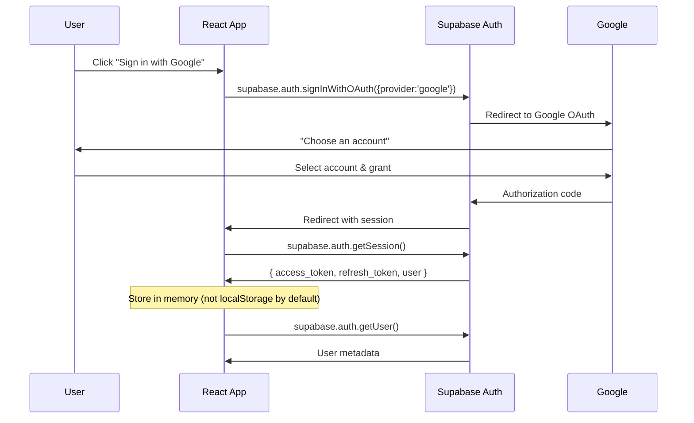

# UCS Task Manager — Security

## 1. Authentication Flow



- Supabase Auth handles OAuth flow and token management
- JWT tokens are stored in memory (not localStorage) for security
- `onAuthStateChange` listener syncs auth state across tabs
- Backend verifies JWT on every protected request

---

## 2. Row-Level Security (RLS)

All tables have RLS enabled. Policies are defined in `database-schema.md`.

### RLS Summary

| Table | Read Rule | Write Rule |
|---|---|---|
| `users` | All authenticated users | Own profile only |
| `tasks` | Creator, assignee, or admin | Creator or admin |
| `task_assignees` | Creator, assignee, or admin | Creator or admin |
| `comments` | Anyone who can see the task | Own comment |
| `activity_logs` | Anyone who can see the task | Triggers only (no direct write) |
| `attachments` | Anyone who can see the task | Own uploads |

### Key Principle

**Users can only see tasks they created or are assigned to. Admins can see everything.**

The RLS policy for tasks:
```sql
CREATE POLICY "tasks_select" ON tasks FOR SELECT
  USING (
    created_by = auth.uid()
    OR EXISTS (
      SELECT 1 FROM task_assignees
      WHERE task_id = tasks.id AND user_id = auth.uid()
    )
    OR (SELECT role FROM users WHERE id = auth.uid()) = 'admin'
  );
```

---

## 3. Express Backend Security

### JWT Verification Middleware

```typescript
// backend/src/middleware/auth.ts
import { Request, Response, NextFunction } from 'express';
import { createClient } from '@supabase/supabase-js';

const supabase = createClient(SUPABASE_URL, SUPABASE_ANON_KEY);

export async function authenticate(req: Request, res: Response, next: NextFunction) {
  const token = req.headers.authorization?.replace('Bearer ', '');
  if (!token) return res.status(401).json({ error: 'No token provided' });

  const { data: { user }, error } = await supabase.auth.getUser(token);
  if (error || !user) return res.status(401).json({ error: 'Invalid token' });

  req.user = user;
  next();
}

export async function adminOnly(req: Request, res: Response, next: NextFunction) {
  const { data: profile } = await supabase
    .from('users')
    .select('role')
    .eq('id', req.user.id)
    .single();

  if (profile?.role !== 'admin') {
    return res.status(403).json({ error: 'Admin access required' });
  }
  next();
}
```

### Service Role Key

- The Express backend uses `SUPABASE_SERVICE_ROLE_KEY` to bypass RLS
- This key is **never** exposed to the frontend
- Admin routes are the only ones using this key
- All other backend routes still verify the JWT first

---

## 4. Storage Security

- **Bucket:** `task-attachments` (private)
- Files are accessed via **signed URLs** (expire after 1 hour)
- Upload is restricted to authenticated users
- RLS on `attachments` table ensures users can only see files for tasks they can access

```typescript
// Generate signed URL for file access
const { data } = await supabase.storage
  .from('task-attachments')
  .createSignedUrl(filePath, 3600); // 1 hour expiry
```

---

## 5. Data Protection

| Measure | Implementation |
|---|---|
| **HTTPS** | Enforced on all environments |
| **CORS** | Express backend restricts origins |
| **Rate Limiting** | `express-rate-limit` on admin routes |
| **Input Validation** | Zod schemas on all Express endpoints |
| **SQL Injection** | Supabase JS client parameterizes all queries |
| **XSS** | React auto-escapes JSX output |
| **Environment Variables** | All secrets in `.env`, never committed |

---

## 6. Admin Account Setup

The admin account is configured by setting the `role` field to `'admin'` in the database:

```sql
-- After the admin user signs in via Google, run:
UPDATE users SET role = 'admin' WHERE email = 'admin@ucs.com';
```

This is done manually via Supabase SQL editor or in the seed migration.
